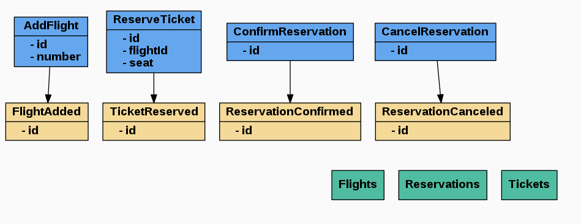

# FlightHub

[](https://php.net/)
[](https://travis-ci.org/akondas/flighthub)
[](https://opensource.org/licenses/MIT)

Flight ticket booking system implemented with CQRS and ES.



> Graph generated from `eventstorming.md` using webeventstorming.com

## Features

### Commands
- [x] Add new flight
- [x] Reserve ticket
- [x] Block seat (with Optimistic Offline Lock)
- [ ] Confirm reservation (with Pessimistic Offline Lock)
- [ ] Cancel reservation (with Implicit Lock)
- [ ] Register customer
- [ ] Add customer address
- [ ] Change customer email (with Coarse-Grained Lock)

> Offline Concurrency Patterns presentation showcase

### Queries
- [x] Health check
- [x] Show flight (by id)
- [x] Search flight by number
- [ ] Show customer (by id)
- [ ] Search customers
- [ ] Show confirmed reservations (by flightId)

### Other
- [x] Frameworkless domain (with EventMachine new **Flavour** feature)
- [ ] Custom projections
- [ ] Integration tests
 
 
## Installation

```
docker-compose up -d
docker-compose run php php scripts/create_event_stream.php
```

## Swagger UI

```
http://localhost:8080/swagger/index.html 
```

## Testing

```
docker-compose run php php vendor/bin/phpunit
```

## License

FlightHub is released under the MIT Licence. See the bundled LICENSE file for details.

## Author

Arkadiusz Kondas (@ArkadiuszKondas)
