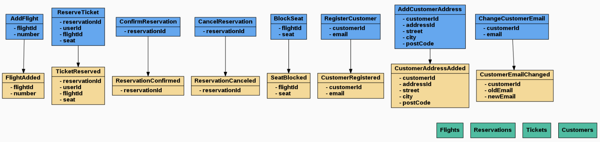

# FlightHub

[](https://php.net/)
[](https://travis-ci.org/akondas/flighthub)
[](https://opensource.org/licenses/MIT)

Flight ticket booking system.



> Graph generated from `eventstorming.md` using webeventstorming.com

## Features

### Commands
- [x] Adding new flight
- [x] Reserve ticket
- [ ] Confirm reservation
- [ ] Cancel reservation 

### Queries
- [x] Show flight (by id)
- [x] Search flight by number
 
## Installation

```
docker-compose up -d
docker-compose run php php scripts/create_event_stream.php
```

## Swagger UI

```
http://localhost:8080/swagger/index.html 
```

## Testing

```
docker-compose run php php vendor/bin/phpunit
```

## License

FlightHub is released under the MIT Licence. See the bundled LICENSE file for details.

## Author

Arkadiusz Kondas (@ArkadiuszKondas)
